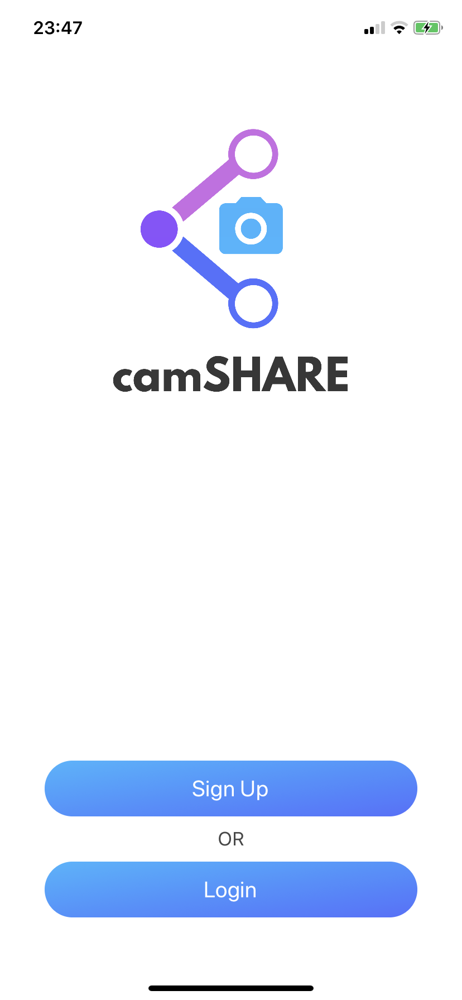
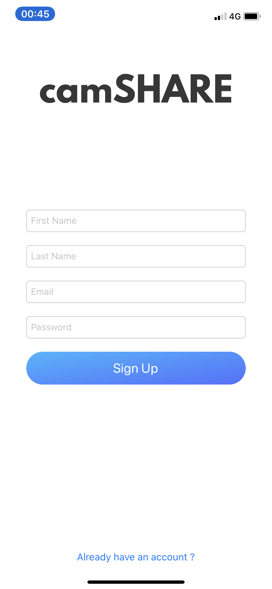
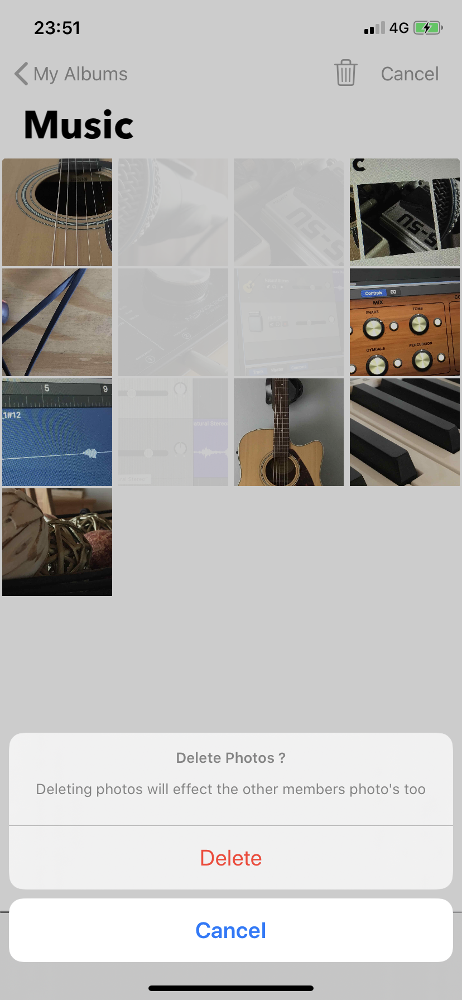
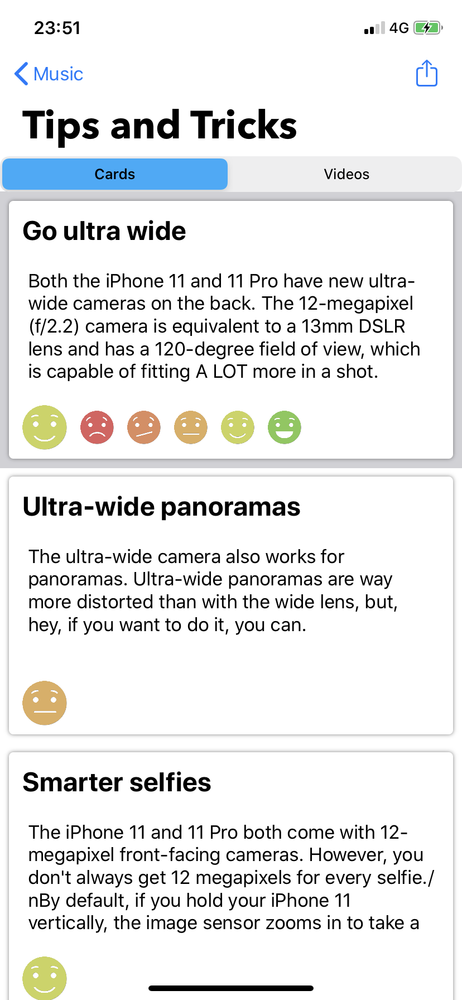
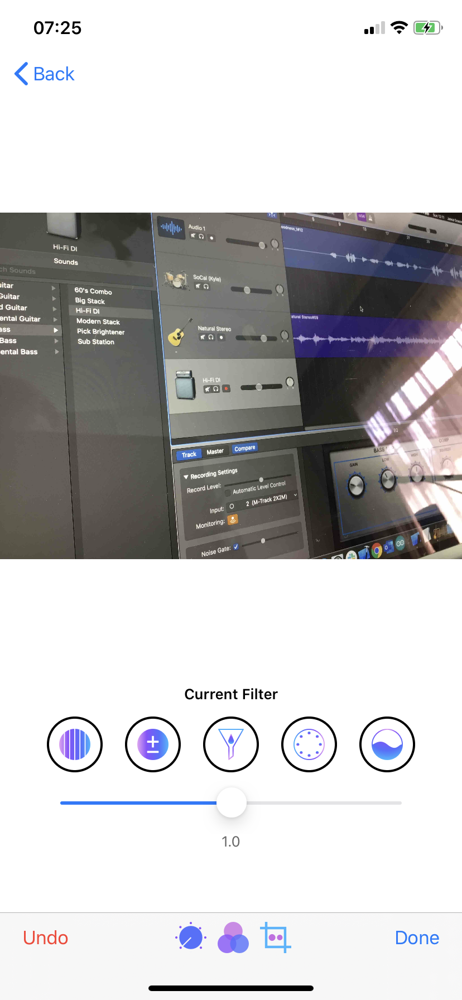
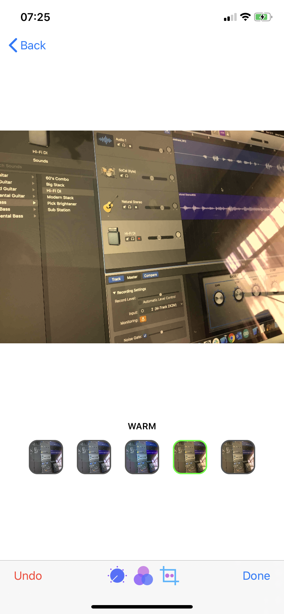
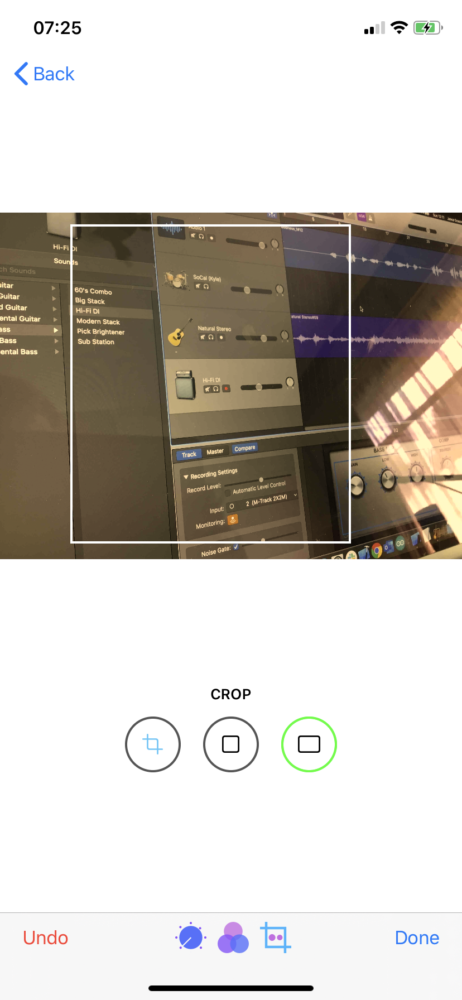

# Camshare

## About
Camshare is a mobile application developed for iOS devices. The purpose of the app is to give users a platform to make groups with their friends to share photos. Camshare is equipped with a camera that allows a user to add photos to a group by directly taking pictures with the built in camera.

## Users
### Overview
In order to keep track of the user's albums, an account needs to be created. After creating an account, the user will not have to sign in again. The app will open fetching the user's albums from the database.

## Albums
### Overview
Albums is displayed in a collection view allowing the user to easily browse through them. 

### Adding Albums
An album can be created through pasting an exiting album ID, or scanning a QR Code created in the album.

### Deleting Albums
Tap on select. This will change the mode to selecting mode which allows the user to select albums. By tapping delete the user will confirm the action and the selected albums will be removed.
Deleting an album will only be deleted from the user's albums and not an album as a whole.

## Photos
### Overview
Photos is displayed as a collection. Tapping on an image wil open a new screen to view the actual image. 

### Camera
Use the in-app camera to take photos. The camera will allow the user to pick between using the photo or retaking it. Once the decides to use it, the photo is added to the album.

### Deleting Photos
Tap on select. This will change the mode to selecting mode which allows the user to select photos. By tapping delete the user will confirm the action and the selected photos will be removed.
Deleting photos will result in deleting the photos from the cloud, essentially effecting every other user that owns the same album.

### Editing Photos
The in-app editor allows the user to edit taken images and save them directly onto the devices camera roll.
Editing include, adjsuting image characteristics, applying preset filters and cropping the image

## Sharing Albums
### QR Code Generator and scanner.
Within the album, tap share. A QR Code will be generated which a second user can scan by tapping the + icon and choosing Scan QR Code

## Tips and Tricks
### Overview
If the user is not familiar with photography, they can tap on the lightbubl icon with the album and they can choose to either checkout the tips cards or watch some videos on youtube.

## Screenshot Examples
### In order of data flow

### Extra
###### Badges

